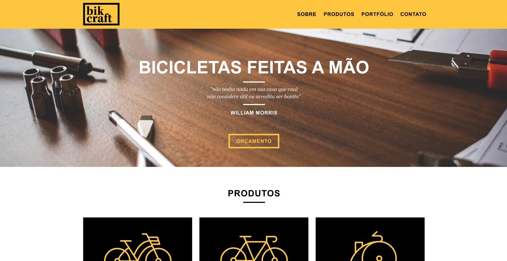

<h1 align="center">
    
</h1>

  <a href="#sobre">Sobre</a>&nbsp;&nbsp;&nbsp;|&nbsp;&nbsp;&nbsp;
  <a href="#interface">Interface</a>&nbsp;&nbsp;&nbsp;|&nbsp;&nbsp;&nbsp;
  <a href="#tecnologias">Tecnologias</a>&nbsp;&nbsp;&nbsp;|&nbsp;&nbsp;&nbsp;
  <a href="#ferramentas">Ferramentas</a>&nbsp;&nbsp;&nbsp;|&nbsp;&nbsp;&nbsp;
  <a href="#licença">Licença</a>&nbsp;&nbsp;&nbsp;|&nbsp;&nbsp;&nbsp;

---

### 🔖 Sobre

  O <b>Bikcraft</b> é um site especializado na comercialização de bicicletas personalizadas de alto padrão. Sob medida para consumidores exigentes.

  Durante o curso de Web Design da <a href="https://www.origamid.com/curso/web-design-completo/" alt="Link do curso da Origamid">Origamid</a>, estudamos desde os princípios do Design passando pelo UI/UX Design até a programação do site. Além disto, foi trabalhado a produção do escopo do projeto, passando pela Arquitetura de Informação desenvolvida para o Wireframe e a partir disto o Design do site. 
  Utilizamos o SASS para produzir um CSS mais performático e boas práticas de HTML semântico. Também foi trabalhado a otimização SEO e implementação do Google Analytics no site.

---

### 🖥️ Interface

<h2 align="center">
    
</h2>

###### Ferramenta utilizada [Adobe XD](https://www.adobe.com/br/products/xd.html). Acesse aqui os links do [Wireframe](https://xd.adobe.com/view/2cef7d80-38b8-4bf0-98c8-2d8ecae26790-79bc/?fullscreen) e [Layout do site](https://xd.adobe.com/view/2a18ce9f-5fe4-4d27-ba82-6d1fe9a197db-7f4b/?fullscreen).

---

### 🚀 Tecnologias

- [HTML](https://developer.mozilla.org/pt-BR/docs/Web/HTML)
- [CSS](https://developer.mozilla.org/pt-BR/docs/Web/CSS)
- [SASS](https://sass-lang.com/)
- [Javascript](https://www.javascript.com/)
- [PHP](https://www.php.net/)

### 🔧 Ferramentas

- **JS Plugins**: [SimpleSlide](https://github.com/origamid/simple-slide), [SimpleAnime](https://github.com/origamid/simple-anime) e [SimpleForm](https://github.com/origamid/simple-form)
- **Mail sender**: [Sendgrid](https://sendgrid.com/)
- **SASS Compiler**: [Scout-App](https://scout-app.io/)

### 📝 Licença

Esse projeto possui a licença MIT. Veja no arquivo [LICENSE](LICENSE) para mais informações.

---

**Feito com 💙 por [Victor Hugo](https://github.com/itsmevictorhugo).**
